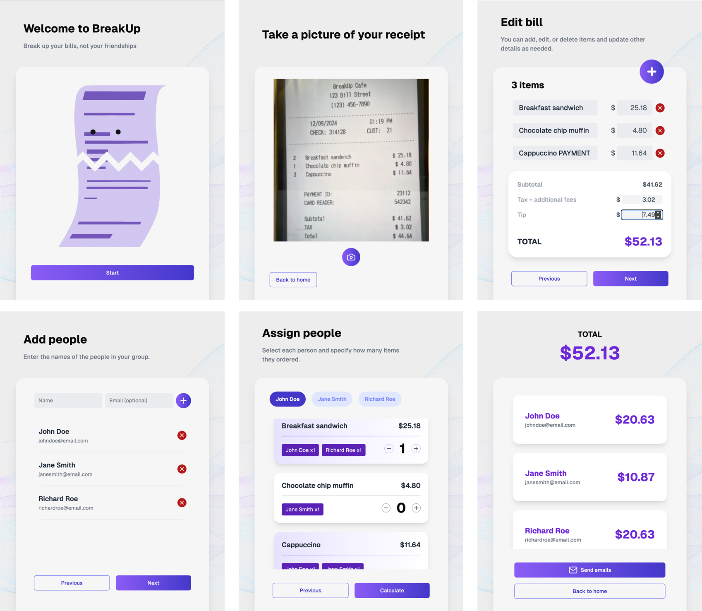

# BreakUp

BreakUp is a web app designed to make bill splitting effortless. Simply take a picture of your receipt, assign items to your friends, and let BreakUp handle the math and notify your friends for you!

Try BreakUp now at https://breakupbills.vercel.app/.




## Prerequisites

1. **Node.js and npm**  

   Download and install from: [https://nodejs.org/en/download/package-manager](https://nodejs.org/en/download/package-manager)  
   Recommended version: **v22.12.0 LTS** 

   Verify installation:
   ```bash
    node -v
    npm -v
   ```

2. **Project Dependencies**  

   Clone the repository and navigate to the project directory:
   ```bash
    git clone https://github.com/audrey-tan/breakupbill.git
    cd breakupbill
   ```

## Getting Started

To start the development server:

1. Navigate to the project root directory:
   ```bash
    cd breakupbill
   ```

2. Run the application in development mode:
    ```bash
     npm run dev
    ```

## Troubleshooting

- **`zsh: command not found: npm`**
  
    Run the following command to load `nvm` (Node Version Manager) into your shell session:
    ```bash
     source ~/.nvm/nvm.sh
    ```

- **`Cannot find module '[module name]'`**

    Run the following to install the dependency:
    ```bash
     npm install [module name]
    ```

### Still Having Trouble?

No worries! You can check out the deployed version of BreakUp here: https://breakupbills.vercel.app/.

---
